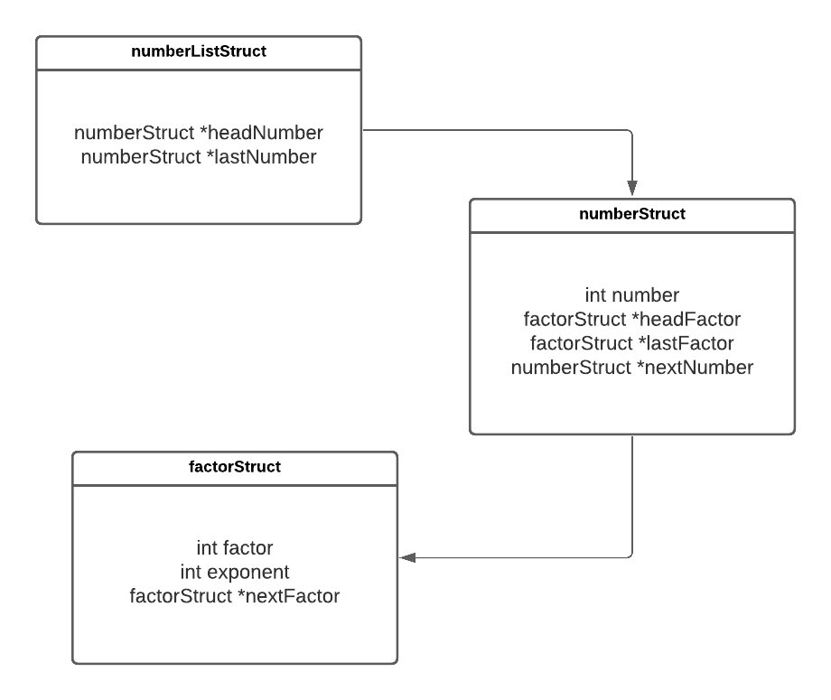
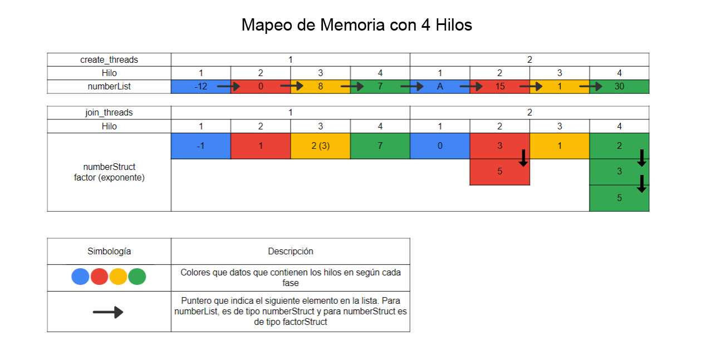

# Factorización Prima de un Número (Diseño OpenMP y MPI)

## Autor
Estudiante: Luis Fernando Gomez Sanchez.

Correo: luis.gomez20@ucr.ac.cr.

Carnet: C03309.

## Diseño de las Estructuras de Datos

<p style='text-align: justify'>
Para las estructuras de datos, se utilizó un diseño basado en listas enlazadas. En total, son tres las estructuras declaradas en el programa que hacen referencia a dos listas enlazadas en específico: una interna con los factores de un número y otra externa con los números ingresados por el usuario.

El diseño implementado en la solución es el siguiente:
</p>

<p style='text-align: center'>

</p>

### Estructura de Lista de Números (numberListStruct)

<p style='text-align: justify'>
Lista enlazada general del programa. Consta únicamente de dos punteros de tipo numberStruct que hacen referencia a la cabeza y al último elemento en la lista de números ingresaos.
</p>

### Estructura de Número (numberStruct)

<p style='text-align: justify'>
Estructura que contiene los datos sobre uno de los números ingresados por el usuario. Consta de un número entero que hace referencia al número ingresado, dos punteros de tipo factor que hacen referencia a la cabeza y al último elemento en la lista de factores del número y un puntero de tipo numberStruct que apunta al siguiente número en la lista de números ingresados.
</p>

### Estructura de Factor (factorStruct)

<p style='text-align: justify'>
Es la estructura mínima del programa. Consta de un número entero que hace referencia al factor de un número, un número entero que hace referencia al exponente al cuál se eleva dicho factor, o sea, la cantidad de veces que se repite ese factorStruct y un puntero que apunta al siguiente factor del número.
</p>

## Diseño del Pseudocódigo

<p style='text-align: justify'>
El procedimiento principal es el main y es donde se crea la lista de números y se llaman a las rutinas principales de leer número, calcular los factores primos e imprimirlos en consola.
</p>

```pseudo
procedure  main() do
  set numberList
  set lastPosition = 0
  reader(numberList, lastPosition)
  set factorsList
  calculateFactors(numberList, lastPosition, factorsList)
  printFactorization(numberList, factorsList)
end procedure
```

<p style='text-align: justify'>
El procedimiento de lectura lee de la entrada estándar los números ingresador por el usuario y los almacena en la estructura de la lista enlazada.
</p>

```pseudo
procedure reader(numberList, lastPosition) do
  set number = 0
  while(input(number)) do
    set numberList in lastPosition = number
    set lastPosition = lastPosition + 1
  end while
end procedure
```

<p style='text-align: justify'>
El procedimiento general del cálculo de los factores de un número guarda en listas individuales los factores de cada número.
</p>

```pseudo
procedure calculateFactors(numberList, threadsCount) do
  #pragma omp parallel for num_threads(threadsCount) \ shared(numberList,actualNumber, threads), private(number)
  for (number in numberList) do
    #pragma omp critical
      number = actualNumber
      actualNumber = actualNumber->nextNumber

    factorization(number)
  end for
end procedure
```

<p style='text-align: justify'>
El procedimiento de factorización almacena los factores de un número en una lista para poder imprimirlos más adelante. Si el número es negativo, se coloca -1 en la primer posición de la lista de factores; si el número es 0 o 1, se coloca 1 en la primer posición de la lista de factores; sino, se guardan los factores en la lista de factores.
</p>

```pseudo
procedure factorization(number) do
  set positionFactorList = 0
  if(number > 1)
    while (number % 2 == 0) do
      factorsList[positionFactorList++] = 2
      number /= 2
    end while
    set i = 3
    while (i < sqrt(number)) do
      if (number % i) do
        factorsList[positionFactorList++] = i
        number /= i
      end if
      i+=2
    end while
    if (number > 2) do
      factorsList[positionFactorList++] = number
    end if
  else if (number == 0 || number == 1) do
    factorsList[positionFactorList] = 1
  else do
    factorsList[positionFactorList] = -1
  end if
end procedure
```

<p style='text-align: justify'>
El procedimiento de imprimir los factores muestra en la salida estándar "NA" si la primer posición de la lista de factores es 1, muestra "invalid number" si la primer posición de la lista de factores es -1 y en caso contrario, muestra la lista completa de factores de un número.

```pseudo
procedure printFactorization(numberList, threadsCount) do
  #pragma omp parallel for num_threads(threadsCount) \ shared(numberList,actualNumber, threads), private(number)
    for (number in numberList) do
      #pragma omp critical
        number = actualNumber
        actualNumber = actualNumber->nextNumber
        printList(number)
    end for
end procedure

procedure printList(number) do
  set condicion = factorsList[0]
  output(number+": ")
  if (condition == 1) do
    output("NA")
  else do
    if (condition == -1) do
      output("invalid number")
    else do
      output(factorsList)
    end if
  end if
end procedure
```

## Diseño del Mapeo de Memoria

<p style='text-align: justify'>
Para el mapeo de memoria de los hilos, se utilizó un ejemplo basado en la creación de 4 hilos por ciclo para procesar 8 números. Con esto, se genera un mapeo dinámico con descomposición por número, lo que crea un <em>conditional safety</em> en el uso de memoria compartida.

El diseño implementado basado en el ejemplo es el siguiente:
</p>

<p style='text-align: center'>

</p>

<p style='text-align: justify'>
El diseño anterior muestra que se asignan tantos números como hilos hayan, con una conexión de un número por hilo. De esta forma, se crearán 4 hilos y se unirán 4 hilos, donde cada hilo procesa un número y cuando termina, sigue trabajando con el siguiente número sin factorizar.

Además, cada número completa la lista de factores en un mismo hilo, indicado con las flechas hacia abajo en la sección del <em>join_threads</em>.
</p>

## Aspectos Generales del Programa

El README general del programa se encuentra [aquí](../README.md).

## Créditos
- <p style='text-align: justify'>Diseño y desarrollo por Luis Fernando Gómez Sánchez; Correo: luis.gomez20@ucr.ac.cr. Año 2021.</p>
- <p style='text-align: justify'>El procedimiento de factorización está inspirado en el realizado por John Ortiz Ordoñez, disponible en este <a href="https://github.com/Fhernd/JavaScriptEjercicios/blob/master/Parte001/ex787-factores-primos-unicos-numero-funcion.js">enlace</a>.</p>