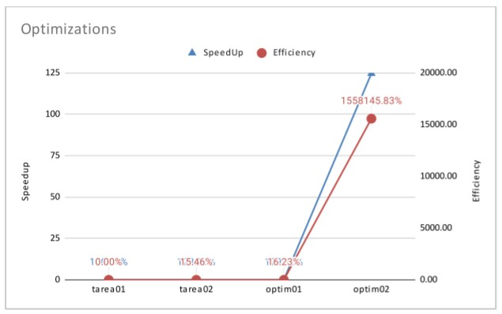
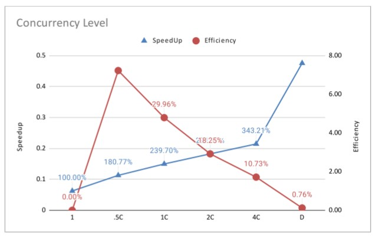

# Factorización Prima de un Número (Reporte de Optimización)

## Autor
Estudiante: Luis Fernando Gomez Sanchez.

Correo: luis.gomez20@ucr.ac.cr.

Carnet: C03309.

## Optimizaciones

### Optimización 1

<p style='text-align: justify'>
La primera optimización busca mejorar los tiempos de ejecución del programa primefact_pthreads mediante un mejor mapeo de la concurrencia. El método de factorización de la version Pthreads del programa realiza la factorización de cada número creando nuevos hilos y dando a cada hilo un número a factorizar para luego eliminar los hilos creados y repetir el proceso con el resto de números faltantes. Claramente, esta solución es muy costosa en cuanto a crear hilos y eliminarlos cada cierta cantidad de tiempo, por lo que el programa se vuelve serial en durante bastante tiempo de ejecución del programa.

La solución encontrada para factorizar de forma eficiente es mediante el uso de mapeo dinámico y de solamente crear y destruir los hilos una vez en toda la ejecución el programa. Con el mapeo dinámico, se logra conseguir que el sistema operativo no gaste recursos en crear hilos con una sola función en su vida útil. EL siguiente código es el que aplica el mapeo dinámico a la hora de dividir sus hilos en cada número a factorizar.
</p>

```c
void* factorization(void* data) {
  ...
  while (threadData->number != NULL) {
    ...
    if (numberValue > 1) {
      /* Version Optimización 1*/
      int64_t currentFactor = 0;
      for (currentFactor = 2; currentFactor <= numberValue; currentFactor++) {
        // Parte de factorizar un número. Es conditionally-safe. 
      }
    } else if (...) {
      ...
    } else if (...) {
      ...
    } else {
      ...
    }
--> sem_wait(&threadData->sharedData->canAccessNode[threadData->thread]);
    threadData->number = threadData->sharedData->number;
    if (threadData->sharedData->number != NULL) {
      threadData->sharedData->number = threadData->number->nextNumber;
    }
    const uint64_t nextThread = (threadData->thread + 1)
      % threadData->sharedData->threadCount;
--> sem_post(&threadData->sharedData->canAccessNode[nextThread]);
  }

  return NULL;
}
```

<p style='text-align: justify'>
Para el control de concurrencia que evita condiciones de carrera se utiliza un semáforo inicializado anteriormente con la cantidad de hilos usados. Este semáforo envía el siguiente número a factorizar y aumenta el puntero auxiliar que recorre la lista para que apenas termine uno de los hilos de factorizar, vaya inmediantamente a agarrar el siguiente número en la lista. Además, por la forma del diseño de listas enlazadas, cada dato privado es conditionally-safe, lo que hace que no ocurran errores al calcular los factores primos de los números.
</p>

### Optimización 2

<p style='text-align: justify'>
La optimización 2 se efectúa mediante la reducción de la complejidad del algoritmo de factorizar y el de calcular los números primos. Este nuevo algoritmo se basa en el algoritmo extraído de <a href="https://www.geeksforgeeks.org/print-all-prime-factors-of-a-given-number/?ref=lbp">GeeksForGeeks</a>. 

Los siguientes métodos son los encargados de factorizar un número. Al combinarlos, tenemos una complejidad de O(n^2) en el peor de los casos, lo cual vuelve al algortimo bastante lento con números muy grandes, esto porque buscará n veces el número primo y n veces la iteración de cada factor.
</p>

```c
bool isPrime(int64_t number) {
  for (int64_t divisors = 2; divisors <= sqrt(number); divisors++) {
    if (number % divisors == 0) {
    return false;
    }
  }
  return true;            
}
```

```c
void* factorization(void* data) {
  ...
  if (numberValue > 1) {
    int64_t currentFactor = 0;
    for (currentFactor = 2; currentFactor <= numberValue; currentFactor++) {
-->   if (isPrime(currentFactor) && (numberValue % currentFactor) == 0) {
        if (dataNumber->number->lastFactor == NULL) {
          addFactor(dataNumber->number, currentFactor);
        } else if (dataNumber->number->lastFactor->factorValue
           == currentFactor) {
          ++(dataNumber->number->lastFactor->exponent);
        } else {
          addFactor(dataNumber->number, currentFactor);
        }
        numberValue /= currentFactor;
        if ((numberValue % currentFactor) == 0) {
          --currentFactor;
        }
      }
    }
  } else if (...) {
    ...
  } else if (...) {
    ...
  } else {
    ...
  }
  return NULL;
}
```
<p style='text-align: justify'>
La solución empleada requiere de menos iteraciones, únicamente requiere de un llamado a una función que recibe un número y se extrae primero las mitades a ese número para luego comenzar a recorrer los números impares en busca de extraer más números primos. Esto reduce considerablemente los tiempos, pues ahora solo se recorre aproximadamente nlog(n) veces el número a factorizar. Al finalizar, revisa si el número encontrado es mayor a 2 y, en ese caso, se agrega dicho número a los factores. Este último caso hace referencia a cuadno dicho número es un número primo.

El siguiente código reemplaza el utilizado en la versión anterior:
</p>

```c
void primeFactors(number* number) {
  // Print the number of 2s that divide n
  int64_t numberValue = number->value;
  while (numberValue % 2 == 0) {
    if (number->lastFactor == NULL) {
      addFactor(number, 2);
    } else if (number->lastFactor->factorValue == 2) {
      ++(number->lastFactor->exponent);
    } else {
      addFactor(number, 2);
    }
    numberValue /= 2;
  }

  // n must be odd at this point.  So we can skip
  // one element (Note i = i +2)
  for (int i = 3; i <= sqrt(numberValue); i = i + 2) {
    // While i divides n, print i and divide n
    while (numberValue % i == 0) {
      if (number->lastFactor == NULL) {
        addFactor(number, i);
      } else if (number->lastFactor->factorValue == i) {
        ++(number->lastFactor->exponent);
      } else {
        addFactor(number, i);
      }
      numberValue /= i;
    }
  }

  // This condition is to handle the case when n
  // is a prime number greater than 2
  if (numberValue > 2) {
    addFactor(number, numberValue);
  }
}
```

## Gráficas

<p style='text-align: justify'>
La gráfica de optimizaciones muestra la velocidad aumentada del tiempo de ejecución de cada una de las versiones, partiendo de que la versión serial es la de tiempo 100%. 

Es posible notar la gran cantidad de velocidad a la que aumentó la versión definitiva de optimización, puesto que la concurrencia y el modelo de factorización utilizado evitan las serializaciones y reduce la cantidad de iteraciones que serán realizadas.
</p>

<p style='text-align: center'>

</p>

<p style='text-align: justify'>
Seguidamente, el gráfico de los niveles de concurrencia muestran que el método con 4 hilos es el más eficiente y el más veloz es el que posee cantidad de hilos igual a la cantidad de números ingresados. Esto puede deberse principalmente al cambio de contexto que realizan los procesadores continuamente y esto retrasa el procesamiento de datos.</p>

<p style='text-align: center'>

</p>

## Conclusiones

<p style='text-align: justify'>
La implementación de estas optimizaciones mejoró considerablemente los tiempos de ejecución del programa, prueba de ello son los tiempos capturados en el archivo <a href="perf_measure-tarea03.pdf">perf_measure-tarea03.pdf</a> el cual contiene un tabla con los diferentes datos recolectados de diversas corridas del programa, ya sea de forma serial o concurrente y con diferentes cantidades de hilos, lo que fortalece los datos planteado en este informe.
</p>

## Aspectos Generales del Programa

El README general del programa se encuentra [aquí](../README.md).

## Créditos
- <p style='text-align: justify'>Diseño y desarrollo por Luis Fernando Gómez Sánchez; Correo: luis.gomez20@ucr.ac.cr. Año 2021.</p>
- <p style='text-align: justify'>El módulo de factorización (hasta optimización 1) está inspirado en el realizado por John Ortiz Ordoñez, disponible en este <a href="https://github.com/Fhernd/JavaScriptEjercicios/blob/master/Parte001/ex787-factores-primos-unicos-numero-funcion.js">enlace</a>.</p>
- <p style='text-align: justify'>El módulo de factorización de optimización 2 está inspirado en el realizado en GeeksForGeeks, disponible en este <a href="https://www.geeksforgeeks.org/print-all-prime-factors-of-a-given-number/?ref=lbp">enlace</a>.</p>
